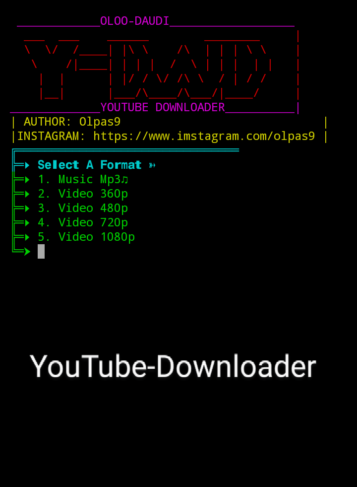

# Y-DWD
Download all YouTube video with termux without any restrictions <br> 
# Follow Author Instagram: https://www.instagram.com/olpas9 <br>
# INSTALLATION
 copy and paste below command in termux  <br>

1. ```  apt update && apt upgrade ```
2. ```  pkg install git ```
3. ```  git clone https://github.com/Olpas9/Y-DWD.git ```
4. ```  cd Y-DWD ```
5. ```  bash YouTube.sh  ```


<br>
<br>

<br>

#  Usage:
-  Open YouTube app then choose any video you want.
-  In video you have chosen click share button.
-  Share into termux then you will be asked to choose quality of video,
-  Click enter then you have done!!, Visit internal file to watch your video offline

#  Enjoy YouTube videos from  your internal storage 😜😜
